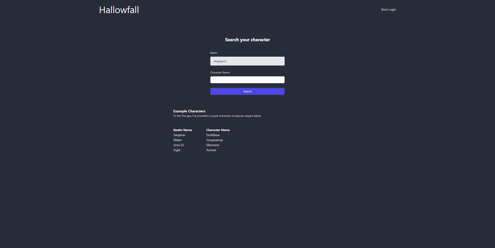
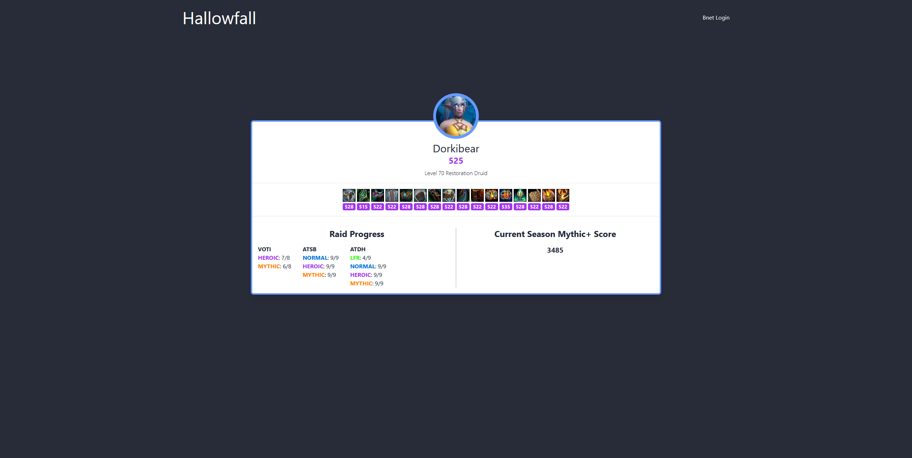
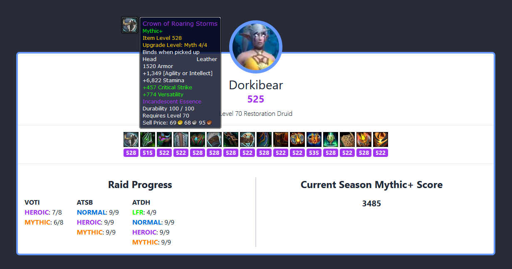

# Welcome to Hallowfall
Hallowfall is a prototype application built with Next.js and Tailwindcss to learn and get comfortable with Blizzard's Battle.net API for World of Warcraft.

The app is currently being rewritten in Typescript and will be utilizing Next.js 14 for its Server Actions features, Auth.js to handle user authentication and login to the users Battle.net account and a MongoDB with Prisma ORM, to store both user access tokens as well as a user profile and relevant profile data from their linked Battle.net account. 

This version of the app will not be hosted for testing. 

## Example Images

### Homepage
The homepage of Hallowfall contains a search function that any user can use, logged in or not, to find any character in World of Warcraft. The realm list is a populated dropdown menu of all the available realms in the US region. This will be expanded to all regions in the next version. 

I have provided a few examples of top ranked players to use as examples.

### Profile view
The profile view contains a rough mockup for the character returned in the search. 

### Profile Features
The profile highlights a few important aspects of the character which includes Raid Progression, Mythic+ Progression, the Characters Gear, and an image of the character. The gear section displays the appropriate icons for the items equipped and when hovering over the icons, displays the correct tooltip for the item. The tooltips are generated using the item data and a useful tool provided by Wowhead.com. 

